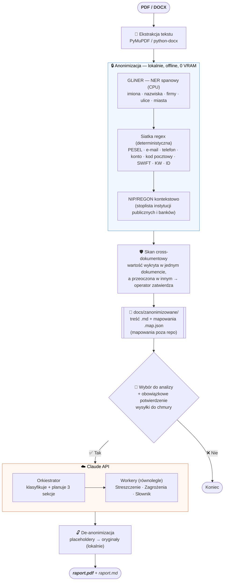

# Analityk Dokumentów

Lokalny analizator umów i dokumentów prawnych z ochroną danych osobowych. Narzędzie anonimizuje wrażliwe dane **lokalnie** (offline) przed wysłaniem do Claude API, a wynik zapisuje jako raport PDF z prawdziwymi danymi (de-anonimizacja odbywa się lokalnie po analizie).

## Jak to działa



Dane osobowe (imiona, PESEL, NIP, adresy, numery kont) zastępowane są placeholderami w formacie `[TYP_N]` (np. `[PESEL_1]`, `[IMIĘ_2]`) i **nigdy nie opuszczają maszyny w oryginale**. Do Claude trafia wyłącznie zanonimizowana treść; mapowania `placeholder → oryginał` zostają lokalnie i służą do odtworzenia prawdziwych danych w raporcie końcowym.

Kwoty, daty, nazwy instytucji państwowych, banków i znanych ubezpieczycieli pozostają nienaruszone (są publicznie identyfikowalne i potrzebne do kontekstu analizy).

## Wymagania

- Python 3.11+
- [uv](https://docs.astral.sh/uv/) — menedżer pakietów
- Klucz API Anthropic

> Anonimizacja działa **w całości na CPU** (model GLiNER, ~0.3B). Nie wymaga GPU ani Ollamy.
> Przy pierwszym uruchomieniu model (~2.2 GB) pobiera się automatycznie z HuggingFace do lokalnego cache.

## Instalacja

```bash
# 1. Sklonuj repozytorium
git clone <url> && cd analityk-dokumentow

# 2. Zainstaluj zależności
uv sync

# 3. Utwórz konfigurację i wpisz klucz API
cp config.example.yaml config.yaml
#    → uzupełnij pole claude.api_key w config.yaml
#    (alternatywnie: echo "ANTHROPIC_API_KEY=sk-ant-..." > .env)
```

> `config.yaml` jest poza repozytorium (`.gitignore`) — bezpiecznie trzymaj w nim klucz API i hasła. Do repo trafia tylko szablon `config.example.yaml`.

## Użycie

Narzędzie ma **interaktywny interfejs (TUI)** — uruchom bez argumentów:

```bash
uv run python main.py
```

Pojawia się menu z dwoma trybami:

### 1. Anonimizuj dokument(y)

Przeglądarka plików (start w katalogu domowym) → wybór pliku albo całego folderu → anonimizacja lokalna. Następnie:

- **Skan bezpieczeństwa (cross-dokumentowy)** — buduje wspólny zbiór wykrytych wartości ze wszystkich plików w partii i sprawdza, czy któraś nie została przeoczona w innym dokumencie. Każdą wątpliwość zatwierdzasz **raz** (decyzja stosuje się do wszystkich dokumentów).
- Artefakty zapisywane są do `docs/zanonimizowane/`:
  - `<nazwa>__anon__<data>.md` — zanonimizowana treść (bezpieczna),
  - `<nazwa>__anon__<data>.map.json` — mapowania z oryginałami (**poza repozytorium**, zob. `.gitignore`).
- Na końcu pytanie, czy od razu przejść do analizy.

### 2. Analizuj zanonimizowany dokument → Claude

Lista zanonimizowanych artefaktów (multi-wybór: `spacja` = zaznacz, `Ctrl+A` = wszystkie). Po wyborze:

- **Obowiązkowe** ręczne potwierdzenie przed wysłaniem do chmury.
- Zaznaczenie wielu dokumentów → analiza w **jednym wspólnym kontekście** (placeholdery przenumerowane bez kolizji) i jeden zbiorczy raport.
- Po analizie raport jest de-anonimizowany lokalnie i zapisywany jako PDF + MD obok artefaktu.

## Konfiguracja

Plik `config.yaml` (skopiowany z `config.example.yaml`, poza repozytorium):

```yaml
anonymizer:
  gliner_model: urchade/gliner_multi-v2.1   # model NER (multilingual, CPU)
  gliner_threshold: 0.5                      # próg pewności — niżej = czulej

claude:
  model: claude-sonnet-4-6                   # model Claude do analizy
  api_key: "sk-ant-..."                      # klucz API (albo w .env — patrz niżej)

# Hasła do zaszyfrowanych PDF-ów — próbowane po kolei
passwords: []
#  - haslo_firmy
```

Klucz API możesz podać w `config.yaml` (`claude.api_key`) **albo** w `.env`
(`ANTHROPIC_API_KEY=...`). Zmienne środowiskowe nadpisują `config.yaml`:

| Zmienna | Opis |
|---------|------|
| `ANTHROPIC_API_KEY` | Klucz API Anthropic (pierwszeństwo nad `claude.api_key`) |
| `GLINER_MODEL` | Nadpisuje `anonymizer.gliner_model` |
| `CLAUDE_MODEL` | Nadpisuje `claude.model` |

## Jak działa anonimizacja

Pipeline jest **trójprzebiegowy** i w pełni lokalny. Placeholdery mają format `[TYP_N]`.

### Przebieg 1 — GLiNER (NER semantyczny)

Enkoderowy model NER (`urchade/gliner_multi-v2.1`, ~0.3B, CPU) wykrywa dane semantyczne, których nie widzi regex: **imiona, nazwiska, nazwy prywatnych firm, ulice, miasta**. Zwraca spany znakowe → podstawienie deterministyczne (po offsetach), bez parafrazowania. Tekst dzielony jest na kawałki ≤320 tokenów, żeby nie przekroczyć limitu modelu i nie zgubić encji.

### Przebieg 2 — siatka regex (dane zawsze prywatne)

Deterministyczna siatka bezpieczeństwa gwarantująca pokrycie danych jednoznacznych:

| Placeholder | Co wykrywa |
|-------------|------------|
| `[PESEL_N]` | 11-cyfrowy numer PESEL |
| `[KONTO_N]` | IBAN `PL` + 26 cyfr; NRB 26-cyfrowy po „nr rachunku" |
| `[TEL_N]` | `+48 XXX XXX XXX` lub 9-cyfrowy od cyfry 4–9 |
| `[EMAIL_N]` | adresy e-mail |
| `[SWIFT_N]` | kody SWIFT/BIC po etykiecie |
| `[KW_N]` | numery ksiąg wieczystych |
| `[ADE_N]` | adresy do doręczeń elektronicznych |
| `[ADRES_N]` | kody pocztowe `XX-XXX` |
| `[ID_N]` | numery dokumentów/umów/wniosków |

### Przebieg 3 — NIP/REGON kontekstowo

NIP i REGON anonimizowane są (`[NIP_N]`, `[REGON_N]`), **chyba że** linia wskazuje instytucję publiczną lub znany bank/ubezpieczyciela (stoplista nazw, dopasowanie po granicy słowa — „ing" nie myli się z „consulting").

**Co nie jest anonimizowane:**
- instytucje państwowe i publiczne: *ZUS*, *NFZ*, *NBP* itp.
- znane banki: *ING Bank Śląski*, *PKO BP*, *Santander*, *mBank*, *Pekao*, *BNP Paribas*, *Alior Bank* itp.
- znani ubezpieczyciele: *PZU*, *Allianz*, *Warta*, *Generali*, *UNIQA* itp.

## Bezpieczeństwo danych

- Plik `.md` wysyłany do Claude zawiera **wyłącznie zanonimizowaną treść** — żadnych oryginałów.
- Mapowania (oryginały) leżą w osobnym pliku `.map.json`, czytanym tylko lokalnie do de-anonimizacji.
- Cały katalog `docs/zanonimizowane/` jest w `.gitignore` — artefakty i raporty nie trafiają do repozytorium.

> **Dla pracujących z [Claude Code](https://claude.com/claude-code):** repozytorium zawiera hook (`.claude/`),
> który blokuje asystentowi odczyt plików mapowań `.map.json` (zawierają oryginalne dane). Hook wymaga
> [`jq`](https://jqlang.github.io/jq/) (`apt install jq` / `brew install jq`). Nie jest potrzebny do
> działania samego narzędzia.

## Format raportu

Każdy raport (PDF z paginacją + kopia MD) zawiera trzy sekcje:

| Sekcja | Zawartość |
|--------|-----------|
| **1. Streszczenie** | Pełne podsumowanie — strony umowy, przedmiot, wszystkie istotne wartości (kwoty, terminy, daty, stopy) |
| **2. Zagrożenia i pytania do drugiej strony** | Tabela: ryzykowna/niejasna klauzula + konkretne pytanie (tylko gdy ma sens w tej umowie) |
| **3. Pojęcia warte doczytania** | Branżowe i prawne terminy z dokumentu wyjaśnione prostym językiem |

## Obsługiwane formaty

- **PDF** — w tym zaszyfrowane (hasła w `config.yaml`, próbowane po kolei; w razie potrzeby narzędzie zapyta o hasło)
- **DOCX** — dokumenty Word
```
